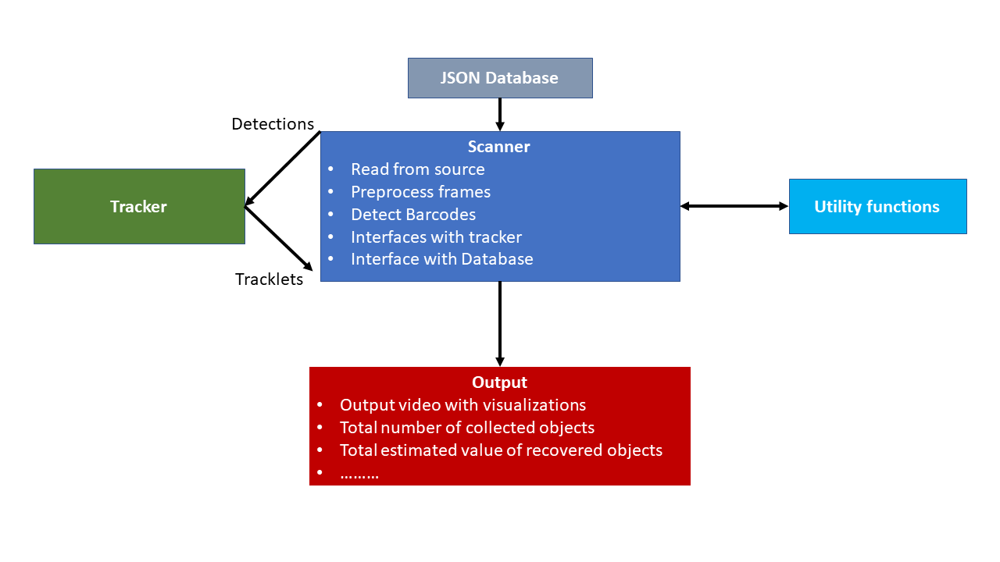
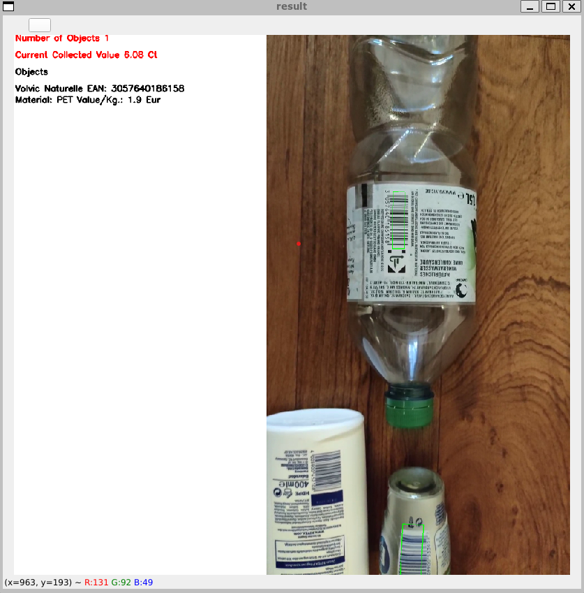

# Tech Challenge 
This repo contains the software components for our Barcode scanning solution implemented with in scope of the Tech-Challenge S22.

## Story
***
As we our task was to come up with an innovative solution to tackle robotizing waste recycling. Our team developed the idea which aims to ultimately create a zero waste stream, this can be done by tracking waste from waste to source. Our prototype aims to showcase the potential of tracking recycable waste present in the collected through computer vision. For that we Built a prototype which consists of a simple conveyer belt, run by a stepper motor. This is combined with a two cameras mounted on the on top of the conveyer belt looking down. Our Software which run on a dedicated Raspberry Pi, processes the camera stream, detects and decodes the barcode present on the products, and finally visualizes the output along with information from our database. Here is a detailed explanation of the Implementation.

## Hardware Components
***
For Building the prototype, the following electronics were used:
    
* [Raspberry Pi Model 4B 2Gb+](https://www.raspberrypi.com/products/raspberry-pi-4-model-b/)
* [Raspberry Pi Model 2B](https://www.raspberrypi.com/products/raspberry-pi-2-model-b/)
* [Raspberry Pi Cam V1.3](https://www.reichelt.de/de/de/raspberry-pi-kamera-5mp-v1-3-rpi-cam-5mp-p314570.html?r=1), documentation can be found [here](https://www.raspberrypi.com/documentation/accessories/camera.html)
* [Microsoft lifecam cinema](https://www.microsoft.com/de-de/d/lifecam-cinema/94f910x3714n?activetab=pivot:%C3%BCbersichttab)
* [Adafruit DC & Stepper Motor HAT for Raspberry Pi - Mini Kit](https://www.adafruit.com/product/2348), documentation can be found [here](https://learn.adafruit.com/adafruit-dc-and-stepper-motor-hat-for-raspberry-pi)
* [Stepper motor - NEMA17](https://www.kiwi-electronics.com/en/stepper-motor-nema17-12v-350ma-2732?search=stepper%20motor)
* 2 x MicroSD cards
* 12 V DC power supply
* [5.1 V USB C power supply](https://www.reichelt.de/raspberry-pi-netzteil-5-1-v-3-0-a-usb-type-c-eu-stecker-s-rpi-ps-15w-bk-eu-p260010.html?PROVID=2788&gclid=CjwKCAjw2rmWBhB4EiwAiJ0mtc_RaNDGuaHWGC3ozoU3LqZpppZHyarI3g860sri6wLrLhXnmMKjWRoCi5IQAvD_BwE)
* [5 V Micro-USB power supply](https://www.reichelt.de/raspberry-pi-netzteil-5-v-2-5-a-micro-usb-schwarz-nt-musb-25-sw-p167078.html?PROVID=2788&gclid=CjwKCAjw2rmWBhB4EiwAiJ0mtSD74tcbA-ai6cJL6SEj6jwAfzOlYpV4Agib4zcC2536eRd-_vqaOBoCE9AQAvD_BwE)

The parts used for building the conveyer belt were drawn on [Inventor](https://www.autodesk.de/products/inventor/overview). These parts can be found under [components](components/) directory.
The prototype can be completey built using lastercut and 3D printed parts mounted together using bolts. Some components can be bought as well from building supplies stores.
The complete assembly can be found [here](components/conveyer_with_sides.iam).
### Laser cut parts:
***
The following parts can be cut on 6mm HDF plates and mounted together:
* Sides of the conveyer Belt. Design can be found [here](components/Sides.ipt).
* The Pi holder in which the Pi and cameras are mounted to. This consists of two parts, the [sides](components/holder_sides.ipt) and the [holder](components/pi_holder.ipt).
* The two gears transfering the movement from the stepper motor to the belt. [gear1](components/Spur%20Gear14.ipt), and [gear2](components/Spur%20Gear24.ipt).

### 3D printed parts:
***
* The Pi camera mounting [holder](components/pi_camera_mount_v8.stl), the design was adopted from [here](https://www.thingiverse.com/thing:2810155).
* The [rollers](components/roller.ipt) can be printed, but since this can take long times on the 3D printer, pvc pipes from the store can be used instead.
* If PVC pipes are used for the rollers, this [part](components/roller_inner.ipt) should be printed to mount the pipes on the shafts (Welle).

## Software Components
***

### Barcode Detection
***
The Barcode detection algorithm running on a [Raspberry Pi Model 4B 2Gb+](https://www.raspberrypi.com/products/raspberry-pi-4-model-b/) consists of the following modules:
* The [Scanner](scanner.py): This is the main module executing the barcode detection and decoding algorithm. The module contains several algorithms for processing image frames. The processing is mainly carried out using [OpenCV](https://opencv.org/) python library, in addition to utilizing the [Zbar](http://zbar.sourceforge.net/) linux library and it's python wrapper [Pyzbar](https://pypi.org/project/pyzbar/) and [Dynamsoft Barcode Reader SDK](https://pypi.org/project/dbr/) for decoding the detected barcodes.
* Several utility functions are implemented in this [file](utils.py).
* Two mutliple object tracker (MOT) algorithms were adopted to track the detected barcodes along the conveyer belt, to prevent multiple detection and decoding of the same object more than once, as well as assigning unique IDs for each detected object. The two trackers adopted are [SORT](sortTracker.py) tracker adopted from [here](https://arxiv.org/abs/1602.00763?context=cs), as well as [Centroid](centroidtracker.py) adopted from [here](https://pyimagesearch.com/2018/07/23/simple-object-tracking-with-opencv/).

All other python packages needed can be found in the [requirements](requirements.txt)
Specific function description is to found in the python files for each function, in addition to the inputs/outputs and other comments.
<p align="center">
  
</p>

### Run the Barcode scanner:
***
First of all, a fresh OS image has to be installed on the micro SDcard for the [Raspberry Pi Model 4B 2Gb+](https://www.raspberrypi.com/products/raspberry-pi-4-model-b/).  A more detailed tutorial can be found [here](https://www.raspberrypi.com/documentation/computers/getting-started.html).

After booting up the Pi and connecting to a screen or connecting per SSH, open a terminal and clone the repo:

```console
pi@raspberrypi:~$ git clone https://github.com/zizo1111/tech_challenge.git
```
In the project's directory, create a python virtual enviroment [venv](https://docs.python.org/3/library/venv.html) and activate it:
```console
pi@raspberrypi:~$ python3 -m venv tech_env
pi@raspberrypi:~$ source tech_env/bin/activate
```
Install the required packages listed in the [requirements](requirements.txt) file:
```console
(tech_env)pi@raspberrypi:~$ pip install -r requirements.txt
```
The scannner is then ready to be run, for this there are several options available that can be chosen by the user such as input source and other settings. For more info run:
```console
(tech_env)pi@raspberrypi:~$ python3 scanner.py -h
usage: scanner.py [-h] [-s [{usb,picam,vid,img}]] [-p PATH] [--database_path DATABASE_PATH] [-d DSTDIR] [--width [WIDTH]] [--height [HEIGHT]] [--show_raw SHOW_RAW] [--show_res SHOW_RES] [--write_vid WRITE_VID]
                  [--tracker [{sort,centroid,none}]]

optional arguments:
  -h, --help            show this help message and exit
  -s [{usb,picam,vid,img}], --src [{usb,picam,vid,img}]
                        select input source (default: img)
  -p PATH, --path PATH  video/image path
  --database_path DATABASE_PATH
                        video/image path
  -d DSTDIR, --dstDir DSTDIR
                        path to the destination
  --width [WIDTH]       camera frame width
  --height [HEIGHT]     camera frame height
  --show_raw SHOW_RAW   show raw frame
  --show_res SHOW_RES   show processed frame
  --write_vid WRITE_VID
                        write_out video
  --tracker [{sort,centroid,none}]
                        tracker (default: sort)
```
Run the scanner on a already recorded video:
```console
(tech_env)pi@raspberrypi:~$ python scanner.py -s vid -p PATH_TO_VID
```
Run the scanner using the usb cam:
```console
(tech_env)pi@raspberrypi:~$ python scanner.py -s usb
```
Run the scanner using the picam:
```console
(tech_env)pi@raspberrypi:~$ python scanner.py -s picam
```
The output window shoulf look like this

<p align="center">
  
</p>

### Running the stepper motor
***
The stepper motor used for moving the conveyer belt is controlled using the [Adafruit DC & Stepper Motor HAT for Raspberry Pi - Mini Kit](https://www.adafruit.com/product/2348) mounted on the other Pi.
First the OS has to be installed on the microSD card for this pi as well. A more detailed tutorial can be found [here](https://www.raspberrypi.com/documentation/computers/getting-started.html).

Once this step is done, I2C has to be enabled on the the PI. A more detailed tutorial can be found [here](https://learn.adafruit.com/adafruits-raspberry-pi-lesson-4-gpio-setup/configuring-i2c).

Install the Adafruit CircuitPython MotorKit library along with the necessary dependencies.
```console
pi@motorpi:~$ sudo pip3 install adafruit-circuitpython-motorkit
```
Download this python [file](motor.py)  
```console
pi@motorpi:~$ wget https://raw.githubusercontent.com/zizo1111/tech_challenge/master/motor.py
```

Finally run the motor by:
```console
pi@motorpi:~$ python motor.py
```

# 2. Step by Step Tutorial

### Preparation
For preparation print two rubber plugs in the 3d printer (you can find them in our repo), as it takes some hours. For the other material you can just follow the buy list and get most of the stuff in a regular hardware store.

### Step 1: Decide for the conveyor dimension and cut the pieces
First of all, the dimensions of the conveyer belt itself needs to be decided. We choose, to cut a 2.00m steel bar in two pieces (=1m length) and cut the rolls in 30cm pieces. With rolls every 16.67cm, we needed 6 rolls. The next step would be cutting everything as needed.
Step 2: Prepare the rolls and insert them

For this step you need per cutted roll (not for the motor roll, that means 5/6): a lot of sandpaper, 2 bearings, 2 screws and 2 nuts (M8), 4 flat washers (Unterlegscheiben, inner diameter 8mm) and the roll. That meant we need 10 pieces from everything and the double amount of washers.

First increase the friction on the outside of the rolls (also the motor roll), by sticking on the sandpaper on each of them. You can cut the sandpaper in multiple strips (length= scope of the roll) and stick 3-4 of them on each roll with hot glue.

After everything is dryed, you need to insert the bearings into the roll (it should smuggle in nicely with small pressure, if it’s too loose, add some glue). Then the order is: bearing -> washer -> steel bar -> washer -> nut on both sides. Prepare each position and tighten the screws a little bit. Only if you have all rolls inserted, tight the screws hard.

### Step 3: Belt

Now the basic frame is set, span a suitable banner over the whole conveyer. It should be a little longer then needed. Make sure that you build up a tension and stick the beginning and the end with instant adhesive. Cut the too long remains.

### Step 4: The motor roll

For the motor roll, you need one metal rod (4mm), which should be longer then the wide of the prototype. Push it through the rubber plug, the roll and the other rubber plugs. Fasten the two rubber plugs at the ends of the roll with hot glue. Then place the metal rod into two holes in the bar. 

### Step 5: The motor

Here we will discuss the mechanics of the motor construction. Follow our github page for programming instructions. 
To power the conveyer belt, we use a stepper motor and a speed controller implemented in a raspberry pi. You need to cut the two gears from a stable flat material (we used wood). Fix the smaller gear to the motor and the bigger one to the motor roll. Then place them, so they rotate with each other (see photo).


Connect the motor to the power source and get it run with the raspberry pi. Now you’re finished and everything should work!
